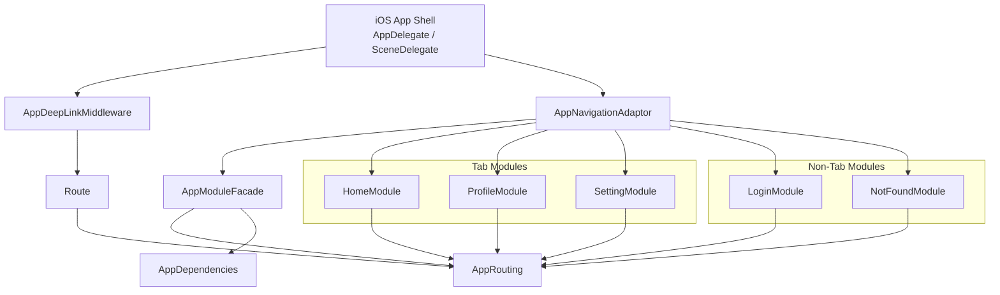

# iOSArchitecture

一个基于 `UIKit + Swift Package Manager` 的 iOS 模块化架构示例项目。  
项目通过统一路由层 `AppRouting` 和门面层 `AppModuleFacade` 组织各业务模块，支持 Tab 场景、模块内路由分发以及 DeepLink 映射。

## 项目结构

```text
iOSArchitecture
├── iOSArchitecture.xcodeproj          # Xcode 工程
├── iOSArchitecture/                   # App 壳工程（UIApplication/Scene）
│   ├── AppDelegate.swift
│   ├── SceneDelegate.swift            # 组装模块、注入依赖、启动导航
│   └── AppDeepLinkMiddleware.swift    # DeepLink 白名单 + 路由表映射
├── Packages/                          # 业务与基础能力模块（SwiftPM）
│   ├── AppRouting/                    # 路由协议、导航样式、Coordinator/Router 抽象
│   ├── AppModuleFacade/               # 模块门面层（统一暴露路由与模块协议）
│   ├── HomeModule/                    # Home 业务模块（Tab + Detail）
│   ├── ProfileModule/                 # Profile 业务模块
│   ├── SettingModule/                 # Setting 业务模块
│   ├── LoginModule/                   # Login 业务模块
│   └── NotFoundModule/                # 兜底模块（未匹配路由）
└── readme.md
```

## 架构说明（简要）

- `AppRouting`：定义路由、导航行为和路由器核心能力，是最底层抽象。
- `AppModuleFacade`：对上层 App 提供统一模块接口，减少业务模块与 App 壳直接耦合。
- `*Module`（Home/Login/Profile/Setting/NotFound）：各自实现模块入口，向路由注册对应页面构建逻辑。
- `SceneDelegate`：集中完成依赖注入、Tab 模块装配、非 Tab 模块注册与应用启动。
- `AppDeepLinkMiddleware`：进行 URL 白名单校验后，将 URL 映射为内部路由对象。

## 环境要求

- Xcode 16+
- Swift 6.2（各 `Package.swift` 已声明）
- iOS 15.0+

## 如何运行

1. 用 Xcode 打开 `iOSArchitecture.xcodeproj`。
2. 等待 Swift Package 依赖解析完成。
3. 选择 `iOSArchitecture` Scheme。
4. 选择任意 iOS Simulator 或真机运行。

## DeepLink 规则（当前实现）

`AppDeepLinkMiddleware` 当前允许：

- Scheme: `myapp`
- Host: `app`

支持的 path 映射示例：

- `myapp://app/home` -> `HomeRoute.home`
- `myapp://app/settings` -> `SettingsRoute.settings`
- `myapp://app/detail?id=1001` -> `HomeRoute.detail(id:)`
- `myapp://app/profile?userId=u001` -> `ProfileRoute.profile(userId:)`

未命中映射时，交由 `NotFoundModule` 兜底处理。

## 新增业务模块（推荐流程）

1. 在 `Packages/` 下创建新 Swift Package（例如 `OrderModule`）。
2. 在模块内实现 `AppModuleProviding` 或 `TabModuleProviding`，并注册路由处理器。
3. 若需要对外定义路由，放在 `AppModuleFacade` 对应业务目录中统一暴露。
4. 在 `SceneDelegate` 中将模块加入：
   - Tab 页面：加入 `tabs`
   - 非 Tab 页面：加入 `appModules`
5. 如需支持 DeepLink，在 `AppDeepLinkMiddleware` 的路由表中新增 path 映射。

## 测试

每个模块都包含独立测试 Target（`Tests/`）。可按模块分别执行单测，或在 Xcode 中统一运行测试。

## 架构设计原则

- **依赖方向单向**：业务模块依赖 `AppRouting`（及必要公共能力），不反向依赖 App 壳；App 壳负责最终装配。
- **路由定义集中**：跨模块可见的路由协议与导航语义由 `AppRouting`/`AppModuleFacade` 统一管理，避免在业务模块中散落定义。
- **模块边界清晰**：每个 `*Module` 只处理本模块路由到页面的映射，不直接感知其他模块内部实现。
- **启动装配集中**：`SceneDelegate` 作为 Composition Root，统一注入依赖、注册模块和启动导航流程。
- **DeepLink 先校验后映射**：先做 scheme/host 白名单校验，再做 path/query 到内部路由的转换，默认保守放行。
- **兜底可观测**：未匹配路由统一进入 `NotFoundModule`，保证异常路径可见、可追踪，而不是静默失败。
- **新增模块最小改动**：新增业务能力时，优先通过“新增模块 + 注册路由 + 场景装配”扩展，避免修改既有模块核心逻辑。

## 架构图



说明：

- App 壳层在 `SceneDelegate` 完成模块装配与依赖注入。
- `AppDeepLinkMiddleware` 负责 URL 到内部 `Route` 的转换。
- `AppNavigationAdaptor` 统一协调 Tab 模块与非 Tab 模块导航。
- 各业务模块通过 `AppRouting` 对齐统一路由与导航协议。

## 路由命名规范（建议）

- **按业务域分组**：路由按模块拆分，例如 `HomeRoute`、`ProfileRoute`、`SettingsRoute`，不要创建“全局大而全路由枚举”。
- **语义优先**：路由 case 使用业务语义命名（如 `.detail(id:)`、`.profile(userId:)`），避免使用页面类名（如 `pushXXXVC`）。
- **参数显式化**：需要的上下文通过关联值声明，避免通过全局状态或 `UserDefaults` 临时传参。
- **导航行为内聚**：每个路由自行声明 `navigationStyle` 和 `requiresAuthentication`，调用方不再重复判断。
- **跨模块路由最小暴露**：只暴露必要对外入口，模块内部页面路由保持 internal，降低耦合面。
- **DeepLink 一一映射**：每条可公开 URL 都应映射到明确路由，并在 README 持续维护示例。

## 新模块模板（脚手架）

下面以 `OrderModule` 为例，给出推荐最小骨架。

### 1) 目录约定

```text
Packages/OrderModule
├── Package.swift
│   └──OrderBiz
│      └── OrderRoute.swift
├── Sources/OrderModule
│   ├── OrderModule.swift
│   └── OrderViewController.swift
└── Tests/OrderModuleTests
    └── OrderModuleTests.swift
```

### 2) Route 示例

```swift
@MainActor
public enum OrderRoute: Routable {
    case list
    case detail(orderId: String)

    public var navigationStyle: NavigationStyle {
        switch self {
        case .list:
            return .push(animated: true)
        case .detail:
            return .push(animated: true)
        }
    }

    public var requiresAuthentication: Bool { true }
    public var associatedModule: String { AppModuleName.order.rawValue }
}
```

### 3) Module 入口示例

```swift
import AppModuleFacade

@MainActor
public final class OrderModule: AppModuleProviding {
    public init() {}
    public var moduleName: String { AppModuleName.order.rawValue }

    public func registerRouteHandlers(name: String, into resolver: AppModuleBootstrap) {
        resolver.append(moduleName: moduleName) { route, routing in
            guard let route = route as? OrderRoute else { return nil }
            switch route {
            case .list:
                return OrderViewController(routing: routing)
            case .detail(let orderId):
                return OrderViewController(routing: routing, orderId: orderId)
            }
        }
    }
}
```

### 4) 接入清单

1. 在 `SceneDelegate` 的 `appModules`（或 `tabs`）里注册 `OrderModule()`。
2. 在 `AppModuleFacade` 增加 `order` 模块名（如 `AppModuleName.order`）。
3. 若需 DeepLink，补充 `AppDeepLinkMiddleware` 路由表：
   - `myapp://app/order` -> `OrderRoute.list`
   - `myapp://app/order/detail?orderId=xxx` -> `OrderRoute.detail(orderId:)`
4. 为 `OrderModule` 添加基础单测，至少覆盖：
   - route -> viewController 解析成功
   - 非本模块 route 不应误匹配
